# Demo Walkthrough

This file matches the screenshots in `docs/demo_walkthrough_images`. Each section links the transcript used to capture the image and explains what that step proves in the demo.

The seeded records use the fixed base time `2030-01-15T10:00`, so the doctor, patient, appointment, and bill IDs remain stable across runs. Runtime values such as `generatedAt` in billing still reflect the actual machine time.

## Core Commands

Seed the demo data:

```bash
mvn -q exec:java -Dexec.mainClass=com.airtribe.meditrack.test.DemoDataSeeder
```

Launch the console app with persisted data:

```bash
mvn -q exec:java -Dexec.mainClass=com.airtribe.meditrack.Main -Dexec.args="--loadData"
```

Run the manual verification suite:

```bash
mvn -q exec:java -Dexec.mainClass=com.airtribe.meditrack.test.TestRunner
```

## 1. Setup and Startup

### Image 01. Seed deterministic demo data

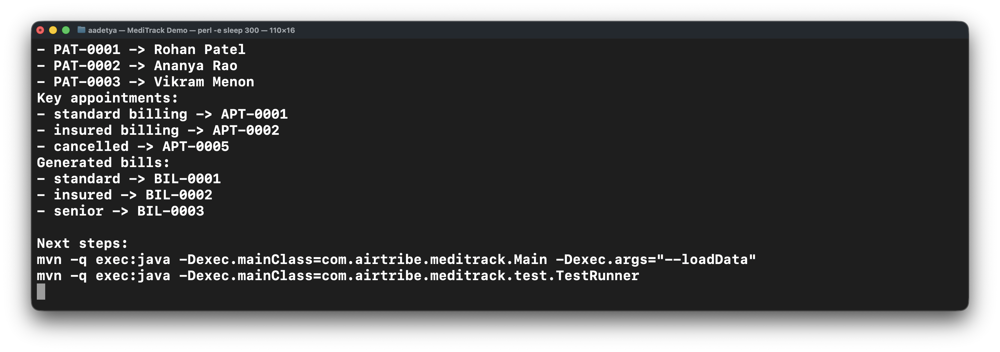

Transcript: [`01_seeder.txt`](demo_walkthrough_images/01_seeder.txt)

This run creates the baseline dataset used in the rest of the walkthrough. The output shows fixed IDs and counts for doctors, patients, appointments, and bills, so the later screenshots stay easy to follow.

It also confirms that bills are seeded with the rest of the data rather than being created later by hand.

### Image 02. Launch with persisted data


Transcript: [`02_startup_load_data.txt`](demo_walkthrough_images/02_startup_load_data.txt)

This screenshot shows the normal startup path with `--loadData`. The application restores doctors, patients, appointments, and bills before opening the main menu, and it prints the source and count for each store.

The clean exit after stdin closes is also useful. It shows that the application behaves properly in non-interactive runs instead of hanging on input.

## 2. Doctor Flows

### Image 03. Search doctors by name

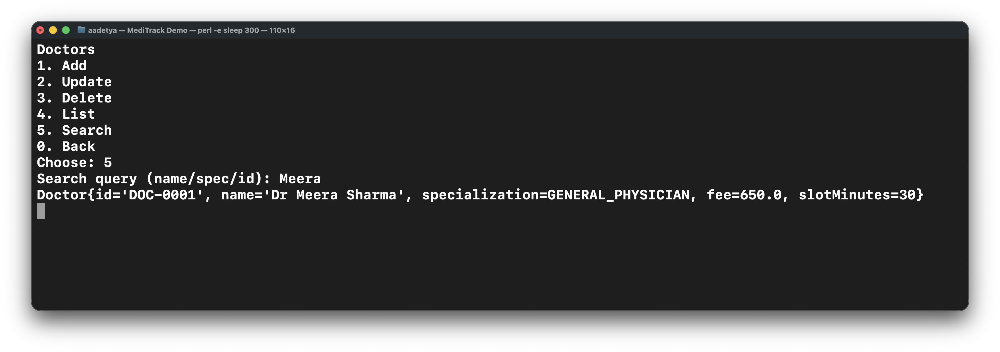

Transcript: [`03_doctors_search_by_name.txt`](demo_walkthrough_images/03_doctors_search_by_name.txt)

This is the simplest doctor lookup path from `Doctors -> Search`. Searching for `Meera` returns `DOC-0001`, which is enough to show that the search is not limited to exact full-name matches.

The point of this step is to show that doctor search is handled centrally instead of being hardcoded into one menu branch.

### Image 04. Search doctors by specialization

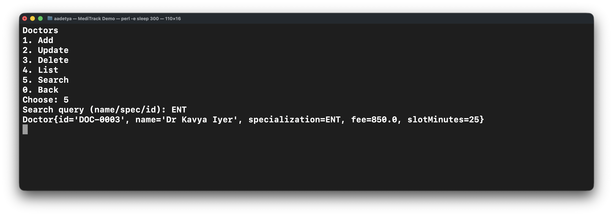

Transcript: [`04_doctors_search_by_specialization.txt`](demo_walkthrough_images/04_doctors_search_by_specialization.txt)

The same search path can also find a doctor by specialization. Entering `ENT` returns `Dr Kavya Iyer`, so the lookup covers more than names and IDs.

Specialization shows up again in the recommendation helper, so this is a useful early proof that the data is wired correctly.

### Image 05. Create a new doctor

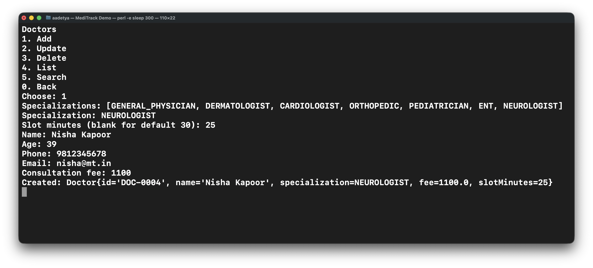

Transcript: [`05_doctor_create.txt`](demo_walkthrough_images/05_doctor_create.txt)

This screenshot shows the doctor creation flow. The console collects specialization, slot length, personal details, and consultation fee, then creates `DOC-0004`.

It is a good example of the split between UI and service logic: the menu collects input, but the ID generation and validation happen in the service and entity classes.

## 3. Patient Flows

### Image 06. Search patients through overloaded service methods

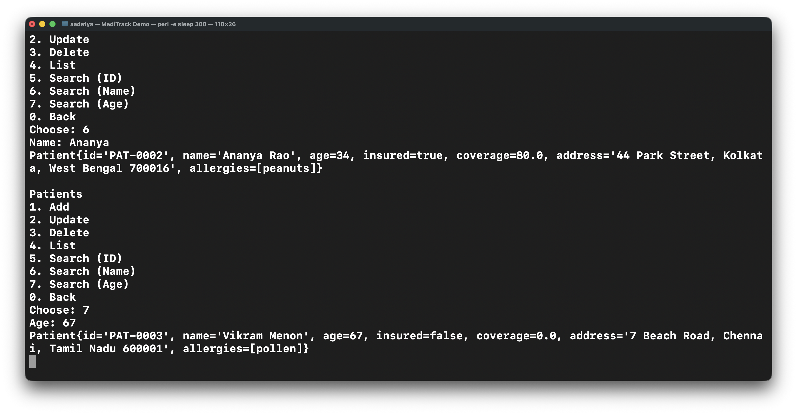

Transcript: [`06_patients_overloads.txt`](demo_walkthrough_images/06_patients_overloads.txt)

This image groups the three patient search modes: by ID, by partial name, and by exact age. Each query returns the right record without forcing everything through one generic search string.

That is the reason the patient service keeps separate search overloads. The API is clearer, and the menu stays simple.

### Image 07. Create a new patient

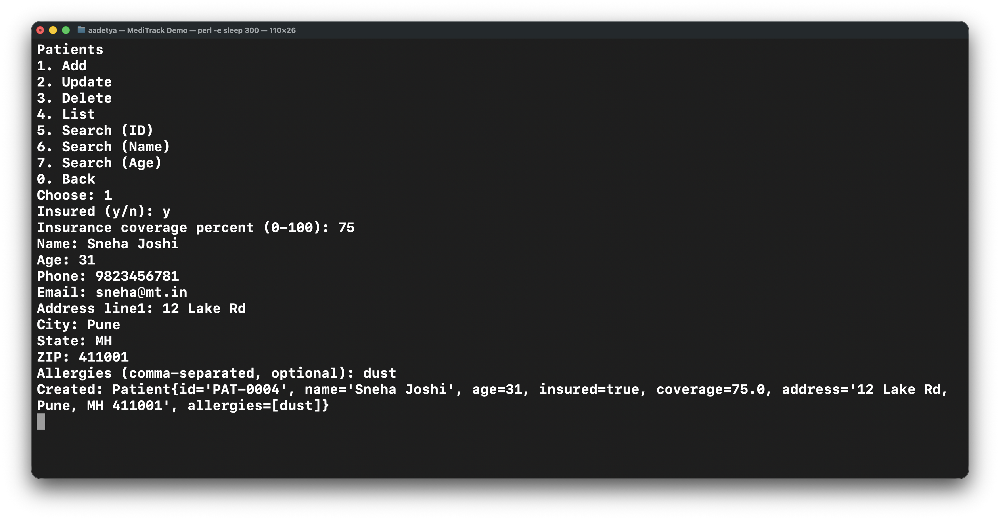

Transcript: [`07_patient_create.txt`](demo_walkthrough_images/07_patient_create.txt)

This is the patient creation flow, including insurance details, address, and allergies. The result is a new patient record `PAT-0004`.

This step also shows that nested state such as address and allergy lists is handled as part of the patient model instead of being scattered through the UI.

## 4. Appointment Scheduling

### Image 08. Suggest the next available slots

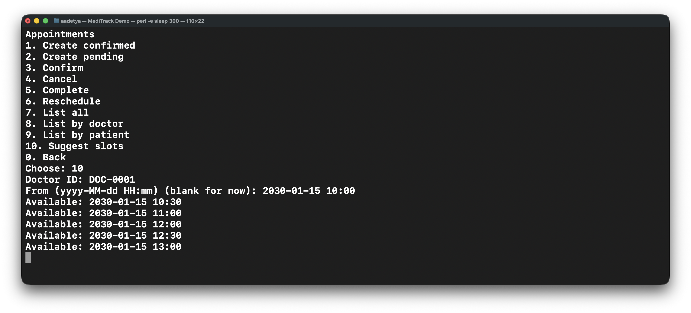

Transcript: [`08_slot_suggestions.txt`](demo_walkthrough_images/08_slot_suggestions.txt)

Here the system suggests future slots for `DOC-0001` starting from `2030-01-15 10:00`. The proposed times skip over occupied windows and respect the doctor's configured slot size.

This is one of the clearer examples of why the scheduling rules live in `AppointmentService` and not in the console code.

### Image 09. Create a confirmed appointment

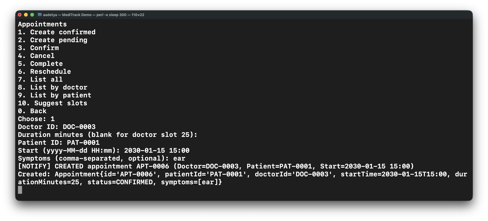

Transcript: [`09_appointment_create.txt`](demo_walkthrough_images/09_appointment_create.txt)

This is the normal appointment creation path. Leaving the duration blank uses the doctor's default slot size, and the system creates `APT-0006` in confirmed state.

The `[NOTIFY] CREATED` line is also part of the story. It shows that appointment side effects are published through observers after the record is created.

### Image 10. Reject an overlapping appointment

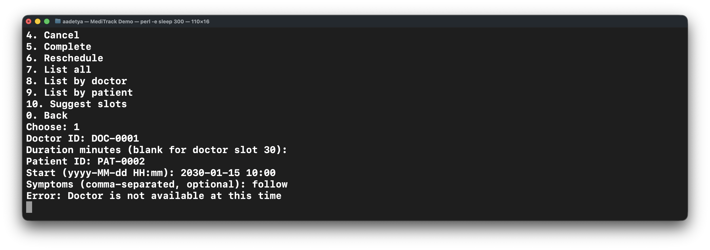

Transcript: [`10_appointment_conflict.txt`](demo_walkthrough_images/10_appointment_conflict.txt)

This attempt tries to book `DOC-0001` at a time that is already occupied. The request is rejected with `Doctor is not available at this time`.

That is the expected behavior for both creation and rescheduling. The same overlap rule is reused across appointment operations.

### Image 11. Cancel an appointment

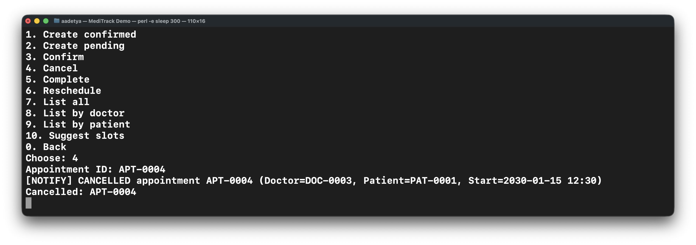

Transcript: [`11_appointment_cancel.txt`](demo_walkthrough_images/11_appointment_cancel.txt)

This screenshot shows a valid lifecycle change from an active appointment to `CANCELLED`. The console prints both the cancellation result and the notification event for `APT-0004`.

It is a small but useful proof that appointment status changes are explicit actions, not loose string updates.

## 5. Billing, Recommendations, and Analytics

### Image 12. Generate a bill summary

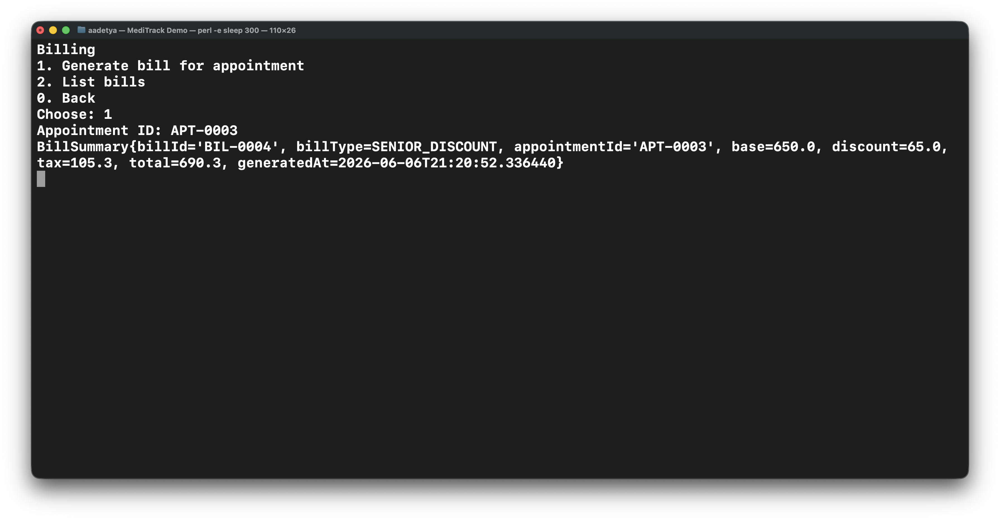

Transcript: [`12_billing.txt`](demo_walkthrough_images/12_billing.txt)

This is the billing flow for a billable appointment. The result is a `BillSummary` for `BIL-0004`, and the bill type shown here is `SENIOR_DISCOUNT`.

The step demonstrates two things at once: pricing depends on patient context, and the UI receives an immutable summary instead of a live mutable bill object.

### Image 13. Use doctor recommendations

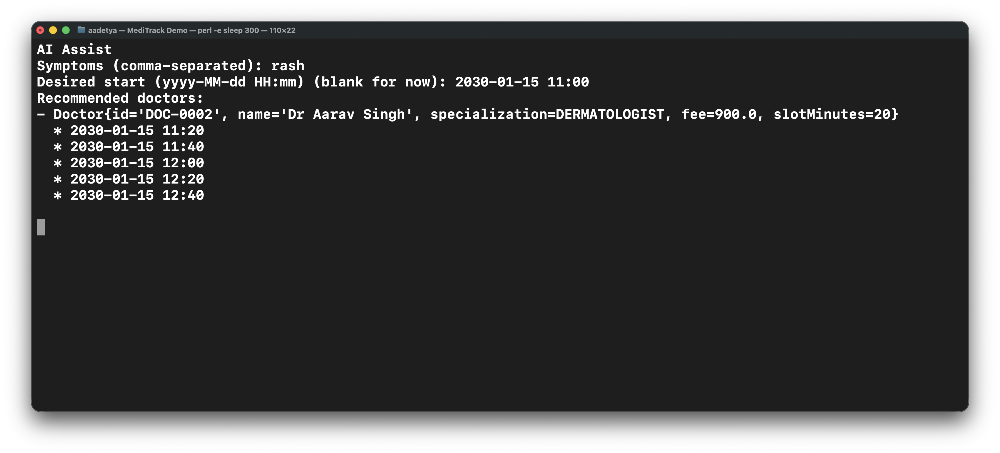

Transcript: [`13_ai_assist.txt`](demo_walkthrough_images/13_ai_assist.txt)

This run enters the symptom `rash` and receives a dermatologist recommendation with open slots. The output is practical rather than vague: it suggests a doctor and immediately shows times that can actually be booked.

The helper is intentionally rule-based. It is meant to be predictable and easy to explain.

### Image 14. View analytics

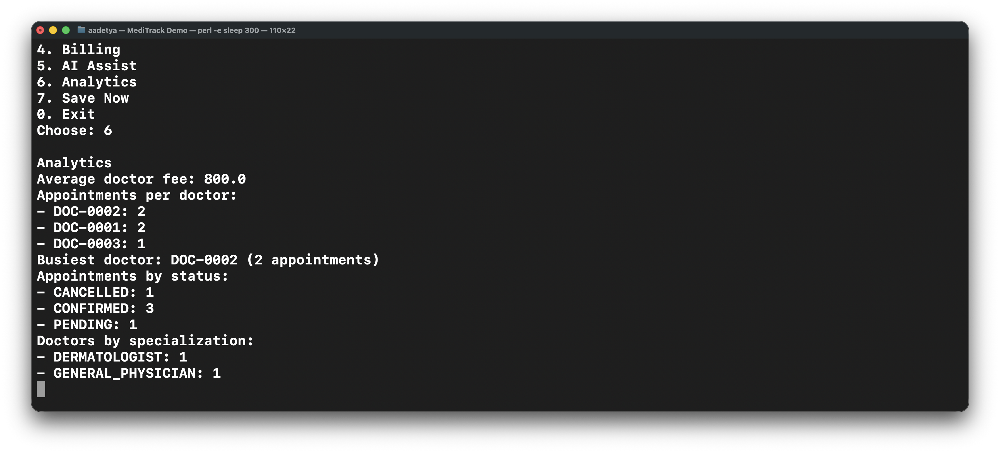

Transcript: [`14_analytics.txt`](demo_walkthrough_images/14_analytics.txt)

This is the analytics view from the main menu. It reports average doctor fee, appointment counts per doctor, the busiest doctor, appointment status counts, and specialization counts.

The numbers come from the current in-memory state, so this page is also a quick check that the stores and service summaries are in sync.

## 6. Save and Reload

### Image 15. Save now and reload persisted data

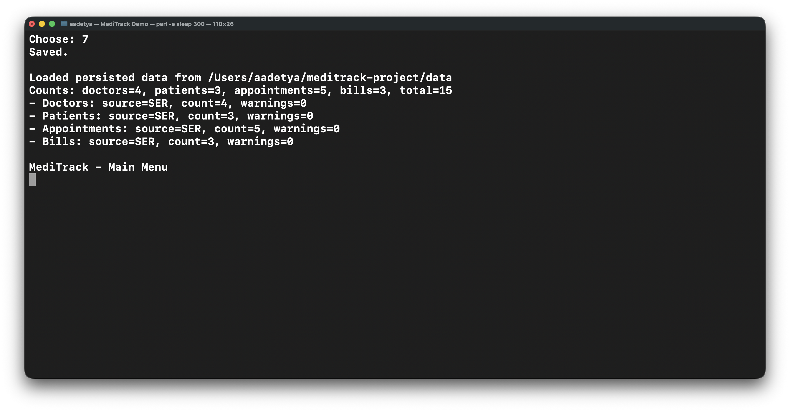

Transcript: [`15_reload_after_save.txt`](demo_walkthrough_images/15_reload_after_save.txt)

This screenshot captures the manual save path and the next startup load. After the save, the reload shows `doctors=4`, which confirms that the newly created doctor was written to disk and restored correctly.

It is a straightforward persistence proof: the state change survives a process restart.

## 7. Manual Verification Output

### Image 16. Representative passing checks

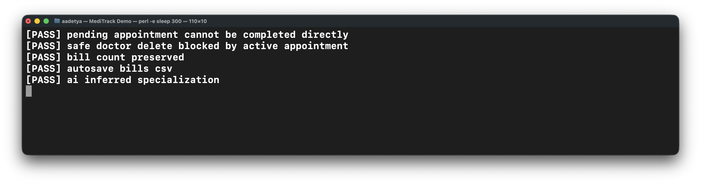

Transcript: [`16_testrunner_checks.txt`](demo_walkthrough_images/16_testrunner_checks.txt)

This slice of the test output shows checks from several different areas: lifecycle rules, safe delete, bill persistence, autosave, and the recommendation helper.

The value of the runner is that it covers the lower-level rules that are harder to show cleanly through menus alone.

### Image 17. Broader test summary


Transcript: [`17_testrunner_summary.txt`](demo_walkthrough_images/17_testrunner_summary.txt)

This screenshot widens the view and shows checks for CSV fallback, observer behavior, reminders, autosave, analytics, and recommendations. The last lines show `Passed: 100`, `Failed: 0`, and `ALL TESTS PASSED`.

It gives a better sense of the project as a whole than one feature-specific screenshot can.

### Image 18. Bill persistence after reload

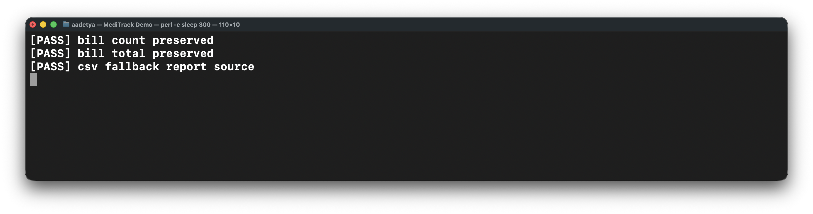

Transcript: [`18_bill_persistence_reload.txt`](demo_walkthrough_images/18_bill_persistence_reload.txt)

This focused check verifies that bills survive save and load correctly. The count and total are both preserved, and the fallback report still identifies the correct source.

That is important because bills were added as a full persisted entity, not just as temporary output.

### Image 19. Reject invalid appointment state transitions

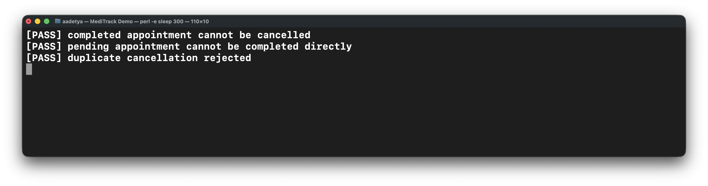

Transcript: [`19_invalid_state_transition.txt`](demo_walkthrough_images/19_invalid_state_transition.txt)

These checks cover the cases that should fail: cancelling a completed appointment, completing a pending appointment directly, and cancelling an appointment twice.

This is the cleanest proof that the appointment lifecycle is enforced as a state machine.

### Image 20. Block unsafe delete operations

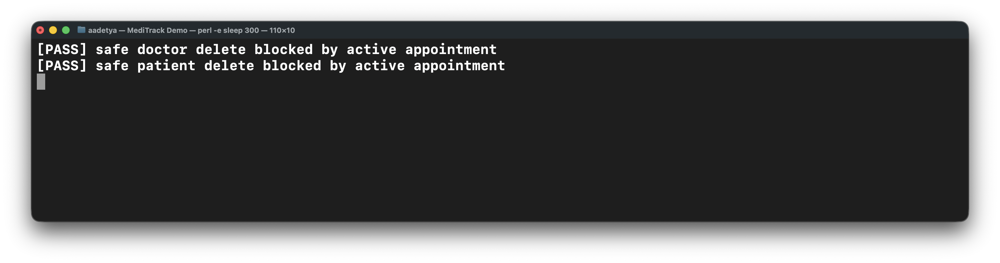

Transcript: [`20_safe_delete_failure.txt`](demo_walkthrough_images/20_safe_delete_failure.txt)

This screenshot shows the safe delete rule in action. Both delete attempts are blocked because active appointments still reference the doctor or patient.

The rule sits in `ClinicManagementService`, which is exactly where this kind of cross-entity check belongs.

### Image 21. Confirm autosave writes every dataset

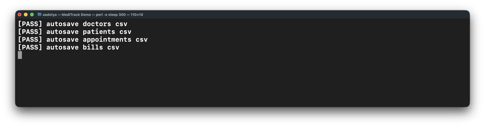

Transcript: [`21_autosave_proof.txt`](demo_walkthrough_images/21_autosave_proof.txt)

This check confirms that autosave writes doctors, patients, appointments, and bills. The same path also writes the matching `.ser` files.

The screenshot matters because autosave is easy to claim and easy to get wrong. Here it is verified explicitly.

### Image 22. Final test summary

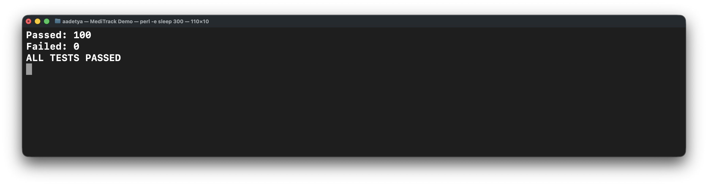

Transcript: [`22_testrunner_summary_v2.txt`](demo_walkthrough_images/22_testrunner_summary_v2.txt)

This is the shortest summary image in the set. It reduces the test run to the final result: `Passed: 100`, `Failed: 0`, `ALL TESTS PASSED`.

It works well as the closing slide because the detailed screenshots already showed what those passes actually cover.

## UML Files

The UML set is split into smaller diagrams:

- `docs/UML_Domain.puml`
- `docs/UML_Architecture.puml`
- `docs/UML_Service_Collaboration.puml`
- `docs/UML_Persistence.puml`

Optional render command:

```bash
brew install plantuml graphviz
plantuml -tsvg \
  docs/UML_Domain.puml \
  docs/UML_Architecture.puml \
  docs/UML_Service_Collaboration.puml \
  docs/UML_Persistence.puml
```
