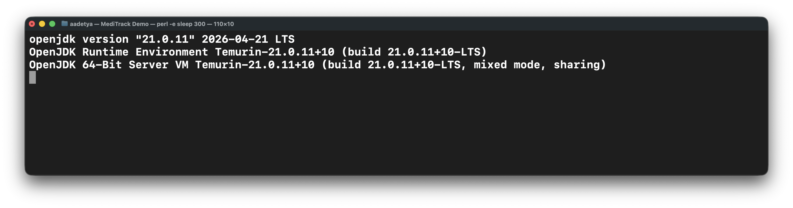
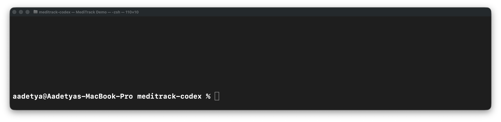
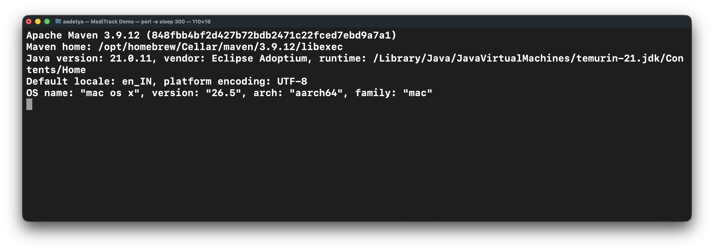
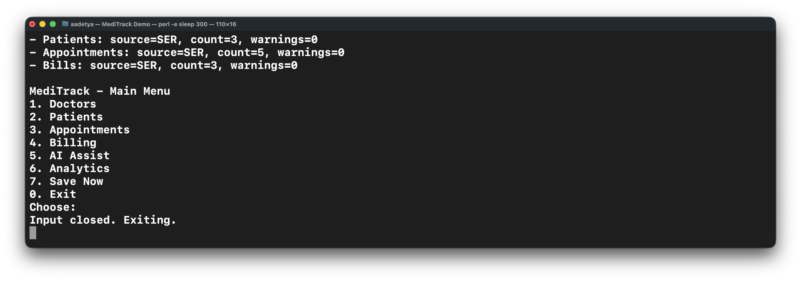
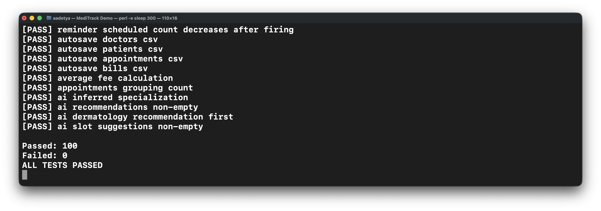
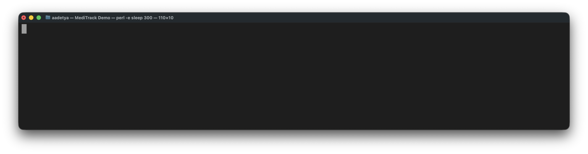

# Setup Instructions

These are the steps used for the final local run of MediTrack. The project target in `pom.xml` is Java 17. The screenshots in `docs/setup_images` were captured on June 6, 2026 with Temurin 21.0.11, which is compatible with the code.

## 1. Check `java`

```bash
java -version
```

Typical output:

```text
openjdk version "21.0.11" 2026-04-21 LTS
OpenJDK Runtime Environment Temurin-21.0.11+10 (build 21.0.11+10-LTS)
OpenJDK 64-Bit Server VM Temurin-21.0.11+10 (build 21.0.11+10-LTS, mixed mode, sharing)
```

Recorded transcript: [`docs/setup_images/01_java_version.txt`](setup_images/01_java_version.txt)



## 2. Check `javac`

```bash
javac -version
```

Typical output:

```text
javac 21.0.11
```

Recorded transcript: [`docs/setup_images/02_javac_version.txt`](setup_images/02_javac_version.txt)



## 3. Check Maven

```bash
mvn -v
```

Typical output:

```text
Apache Maven 3.9.12
Java version: 21.0.11
```

Recorded transcript: [`docs/setup_images/03_maven_version.txt`](setup_images/03_maven_version.txt)



## 4. Build the project

```bash
mvn -q -DskipTests package
```

Expected result:

- `target/classes`
- `target/meditrack-1.0.0.jar`

Recorded transcript: [`docs/setup_images/04_maven_package.txt`](setup_images/04_maven_package.txt)


## 5. Seed the demo data

```bash
mvn -q exec:java -Dexec.mainClass=com.airtribe.meditrack.test.DemoDataSeeder
```

Typical output:

```text
Demo base time: 2030-01-15T10:00
Counts: doctors=3, patients=3, appointments=5, bills=3
```

This step writes both CSV and `.ser` files into `data/`.

Recorded transcript: [`docs/setup_images/05_demo_data_seeder.txt`](setup_images/05_demo_data_seeder.txt)


## 6. Start the console application with persisted data

```bash
mvn -q exec:java -Dexec.mainClass=com.airtribe.meditrack.Main -Dexec.args="--loadData"
```

Typical output:

```text
Loaded persisted data from .../data
Counts: doctors=3, patients=3, appointments=5, bills=3, total=14
- Doctors: source=SER, count=3, warnings=0
- Patients: source=SER, count=3, warnings=0
- Appointments: source=SER, count=5, warnings=0
- Bills: source=SER, count=3, warnings=0
MediTrack - Main Menu
```

If stdin is closed, the application exits cleanly with `Input closed. Exiting.` The recorded screenshot shows that case explicitly.

Recorded transcript: [`docs/setup_images/06_main_load_data.txt`](setup_images/06_main_load_data.txt)



## 7. Run the manual verification suite

```bash
mvn -q exec:java -Dexec.mainClass=com.airtribe.meditrack.test.TestRunner
```

Typical output:

```text
Passed: 100
Failed: 0
ALL TESTS PASSED
```

The runner covers:

- validation edge cases
- cloning and immutability
- appointment lifecycle rules
- conflict detection and rescheduling
- safe delete checks
- billing strategy behavior
- bill persistence and CSV fallback
- observer behavior, reminders, and autosave
- analytics and recommendation logic

Recorded transcript: [`docs/setup_images/07_test_runner.txt`](setup_images/07_test_runner.txt)



## 8. Generate JavaDocs

```bash
mvn -q javadoc:javadoc
```

Expected result:

- `target/site/apidocs/index.html`

Recorded transcript: [`docs/setup_images/08_javadocs.txt`](setup_images/08_javadocs.txt)



## 9. Launch the optional Swing UI

```bash
mvn -q exec:java -Dexec.mainClass=com.airtribe.meditrack.ui.GuiMain
```

Notes:

- The Swing UI is optional.
- The console application remains the main review path.
- In headless environments, `GuiMain` exits cleanly instead of crashing.

## 10. Render the UML

Open any of these files in VS Code:

- `docs/UML_Domain.puml`
- `docs/UML_Architecture.puml`
- `docs/UML_Service_Collaboration.puml`
- `docs/UML_Persistence.puml`

Optional CLI render:

```bash
brew install plantuml graphviz
plantuml -tsvg \
  docs/UML_Domain.puml \
  docs/UML_Architecture.puml \
  docs/UML_Service_Collaboration.puml \
  docs/UML_Persistence.puml
```
